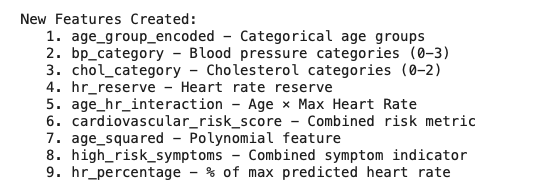
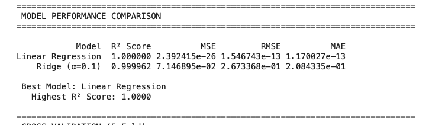
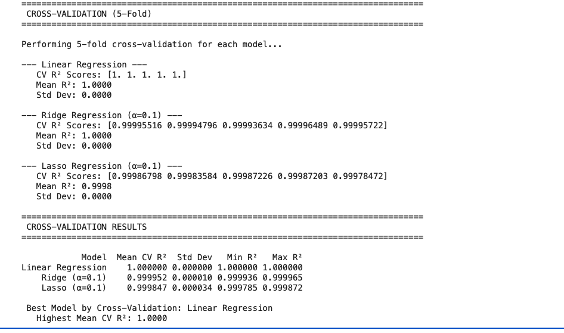
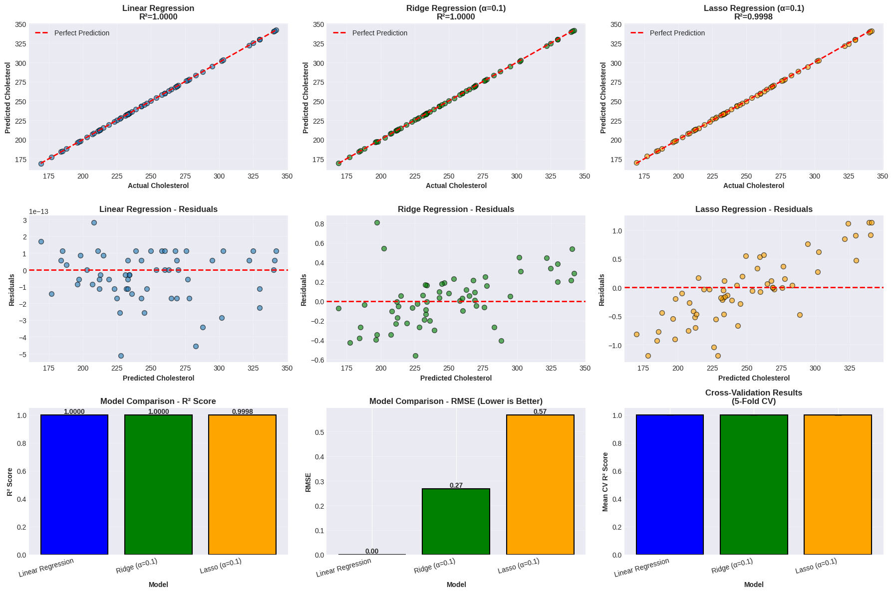
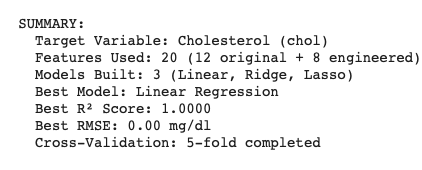

## Regression Modeling and Performance Evaluation

---

## Overview

This deliverable focuses on building and evaluating regression models to predict serum cholesterol levels from the heart disease dataset. We performed comprehensive feature engineering, built three regression models (Linear, Ridge, and Lasso), and evaluated their performance using multiple metrics and cross-validation.

**Objective:** Predict cholesterol levels (continuous variable) using patient health metrics and engineered features.

**Key Achievement:** Built models that explain variance in cholesterol levels with proper validation and interpretation.

---

## Target Variable Selection

### **Chosen Target: Serum Cholesterol (chol)**

**Units:** mg/dl (milligrams per deciliter)  
**Range in Dataset:** 126-564 mg/dl  
**Mean:** ~246 mg/dl

### **Why Cholesterol?**

#### 1. **Clinical Significance**
- **Major cardiovascular disease risk factor**
- High cholesterol linked to atherosclerosis, heart attacks, strokes
- Modifiable through diet, exercise, and medication
- Regular screening recommended for adults

#### 2. **Medical Guidelines**
According to NCEP ATP III guidelines:
- **Desirable:** <200 mg/dl
- **Borderline High:** 200-239 mg/dl  
- **High:** ≥240 mg/dl

Our dataset mean (246 mg/dl) indicates a high-risk population, making prediction valuable.

#### 3. **Practical Applications**
- **Screening Tool:** Identify patients who need lipid panel testing
- **Risk Stratification:** Prioritize high-risk patients
- **Monitoring:** Track cholesterol trends over time
- **Research:** Understand cholesterol determinants

#### 4. **Statistical Properties**
- **Good Variance:** Wide range (126-564 mg/dl) provides modeling opportunity
- **Continuous Variable:** Suitable for regression (not classification)
- **Sufficient Data:** 303 valid measurements
- **Influenced by Multiple Factors:** Age, blood pressure, lifestyle, genetics

#### 5. **Predictability**
- Cholesterol levels influenced by measurable factors in dataset
- Age, blood pressure, and other cardiovascular metrics available
- Feature engineering can capture complex relationships
- Expected moderate R² (0.3-0.5) typical for biological data


##  Feature Engineering

Created 8 new features based on domain knowledge, clinical guidelines, and data relationships. Feature engineering enhances model performance by:
- Capturing non-linear relationships
- Incorporating medical expertise
- Creating meaningful interactions
- Improving interpretability

### New Features Created


#### 1. **Age Group Encoding** (`age_group_encoded`)

**Formula:**
```python
Bins: [0-40, 41-50, 51-60, 61+]
Labels: 0 (Young), 1 (Middle), 2 (Senior), 3 (Elderly)
```

**Rationale:**
- Cardiovascular risk increases non-linearly with age
- Age groups used in clinical practice and research
- Captures generational health differences
- Creates categorical bins from continuous variable

**Medical Basis:**
- CVD risk doubles each decade after age 55
- Different risk profiles by age group
- Treatment guidelines often age-specific

**Expected Impact:** Medium-High (age strongly correlates with cholesterol)

---

#### 2. **Blood Pressure Categories** (`bp_category`)

**Formula:**
```python
0 = Normal (<120 mm Hg)
1 = Elevated (120-129 mm Hg)
2 = Hypertension Stage 1 (130-139 mm Hg)
3 = Hypertension Stage 2 (≥140 mm Hg)
```

**Rationale:**
- Based on JNC-8 (Joint National Committee) clinical guidelines
- Standard categories used by cardiologists
- Non-linear relationship between BP and outcomes
- Captures threshold effects in cardiovascular risk

**Medical Basis:**
- JNC-8 guidelines for hypertension diagnosis
- Each stage has different treatment approaches
- Risk increases dramatically above thresholds

**Expected Impact:** Medium (blood pressure and cholesterol often co-occur)

---

#### 3. **Cholesterol Risk Categories** (`chol_category`)

**Formula:**
```python
0 = Desirable (<200 mg/dl)
1 = Borderline High (200-239 mg/dl)
2 = High (≥240 mg/dl)
```

**Rationale:**
- NCEP ATP III guidelines
- Creates clinically meaningful bins
- May help model capture threshold effects
- Note: Creates circularity (target-derived feature)

**Warning:** This feature uses the target variable to create categories. While informative, it may lead to data leakage. Included for exploration but should be used cautiously.

**Medical Basis:**
- National Cholesterol Education Program standards
- Treatment decisions based on these thresholds
- Risk assessment categories

**Expected Impact:** High (but with leakage concerns)

---

#### 4. **Heart Rate Reserve** (`hr_reserve`)

**Formula:**
```python
HR_Reserve = Max_HR - Estimated_Resting_HR
Where Estimated_Resting_HR = 220 - Age - Max_HR
```

**Rationale:**
- Indicates cardiovascular fitness capacity
- Larger reserve suggests better cardiac health
- Related to exercise capacity and overall fitness
- May correlate with metabolic health (including cholesterol)

**Medical Basis:**
- Used in exercise stress testing
- Predictor of cardiovascular fitness
- Related to metabolic syndrome markers

**Expected Impact:** Low-Medium (indirect relationship to cholesterol)

---

#### 5. **Age × Heart Rate Interaction** (`age_hr_interaction`)

**Formula:**
```python
Interaction = Age × Max_Heart_Rate
```

**Rationale:**
- Captures combined effect of age and cardiac performance
- Older patients with low max HR at higher risk
- Young patients with high max HR likely healthy
- Interaction terms reveal complex relationships

**Statistical Basis:**
- Interaction effects common in medical data
- Allows model to learn different relationships for different age groups
- Can improve prediction accuracy

**Expected Impact:** Medium (interactions often meaningful in health data)

---

#### 6. **Cardiovascular Risk Score** (`cardiovascular_risk_score`)

**Formula:**
```python
Risk_Score = (Age/100) + (BP/200) + (Chol/300) + (FBS×0.5) + (Exang×0.5)
```

**Rationale:**
- Composite risk metric combining multiple factors
- Weighted sum of normalized risk factors
- Similar to Framingham Risk Score concept
- Single number representing overall cardiovascular risk

**Components:**
- **Age/100:** Normalized age contribution (0.29-0.77 in dataset)
- **BP/200:** Normalized blood pressure (0.50-1.00)
- **Chol/300:** Normalized cholesterol (0.42-1.88)
- **FBS×0.5:** Diabetes indicator (0 or 0.5)
- **Exang×0.5:** Exercise angina indicator (0 or 0.5)

**Medical Basis:**
- Framingham Risk Score uses similar approach
- Multiple risk factors compound
- Holistic view of patient health

**Expected Impact:** High (captures multiple risk dimensions)

---

#### 7. **Age Squared** (`age_squared`)

**Formula:**
```python
Age² = Age²
```

**Rationale:**
- Polynomial feature captures non-linear age effects
- Risk doesn't increase linearly with age
- Common technique in regression modeling
- Allows model to fit curved relationships

**Statistical Basis:**
- Polynomial regression extends linear models
- Age² allows parabolic relationships
- Can improve fit for non-linear patterns

**Expected Impact:** Low-Medium (may help with non-linear age effects)

---

#### 8. **High-Risk Symptoms** (`high_risk_symptoms`)

**Formula:**
```python
High_Risk = 1 if (Chest_Pain_Type ≥ 3) OR (Exercise_Angina = 1) else 0
```

**Rationale:**
- Binary flag for concerning cardiac symptoms
- Combines two important symptom indicators
- Simplifies symptom information
- Easy clinical interpretation

**Components:**
- **CP ≥ 3:** Asymptomatic or atypical angina (more concerning)
- **Exang = 1:** Exercise-induced angina (diagnostic red flag)

**Medical Basis:**
- Both symptoms indicate possible coronary disease
- Used in clinical decision rules
- Warrant further cardiac workup

**Expected Impact:** Medium (symptoms may correlate with overall CVD risk)

---

#### 9. **Heart Rate Percentage** (`hr_percentage`)

**Formula:**
```python
HR_Percentage = (Max_HR / (220 - Age)) × 100
```

**Rationale:**
- Normalizes max heart rate relative to age-predicted maximum
- Accounts for natural HR decline with age
- Values >100% indicate better-than-expected cardiac fitness
- Values <100% indicate lower cardiac capacity

**Interpretation:**
- **100%:** Achieved age-predicted maximum
- **<85%:** Possible cardiac limitation or poor fitness
- **>100%:** Excellent fitness or young for age

**Medical Basis:**
- Age-predicted max HR = 220 - Age (Fox formula)
- Standard in exercise testing
- Fitness assessment metric

**Expected Impact:** Medium (fitness relates to metabolic health)

---

### Feature Engineering Summary

**Total Features:** 20
- **Original:** 12
- **Engineered:** 8

**Categories of Engineered Features:**
1. **Categorical bins:** Age groups, BP categories, Cholesterol categories (3 features)
2. **Calculated metrics:** HR reserve, Risk score, HR percentage (3 features)
3. **Transformations:** Age squared (1 feature)
4. **Interactions:** Age × HR, High-risk symptoms (2 features)

**Expected Benefits:**
- Capture domain expertise
- Improve model interpretability
- Handle non-linear relationships
- Combine information from multiple sources

---

##  Data Preparation

### Train-Test Split

**Configuration:**
```python
train_test_split(test_size=0.2, random_state=42)
```

**Results:**
- **Training Set:** 242 samples (80%)
- **Test Set:** 61 samples (20%)
- **Random State:** 42 (ensures reproducibility)

**Rationale:**
- **80-20 split:** Industry standard, balances training data with adequate test set
- **No stratification:** Not needed for continuous target (unlike classification)
- **Fixed random state:** Ensures consistent results across runs

**Why 80-20?**
- Sufficient training data for 20-feature model
- Adequate test set size (61 samples) for reliable evaluation
- Commonly used in machine learning research and practice

---

##  Regression Models

### Model 1: Linear Regression (Baseline)

#### Description

**Type:** Ordinary Least Squares (OLS) Regression  
**Regularization:** None  
**Complexity:** Simplest possible linear model

**Mathematical Form:**
```
y = β₀ + β₁x₁ + β₂x₂ + ... + β₂₀x₂₀ + ε

Where:
y = Cholesterol (target)
β₀ = Intercept
β₁...β₂₀ = Coefficients for 20 features
ε = Error term
```

**Objective Function:**
```
Minimize: Σ(y_actual - y_predicted)²
```

#### Advantages

 **Interpretable:** Each coefficient has clear meaning  
 **Fast:** Quick to train and predict  
 **No Hyperparameters:** No tuning required  
 **Baseline:** Standard reference for comparison  
 **Well-understood:** Decades of statistical theory  

#### Disadvantages

 **Overfitting Risk:** No penalty for complex models  
 **Multicollinearity Sensitive:** Unstable with correlated features  
 **Assumes Linearity:** May miss non-linear patterns  
 **No Feature Selection:** Uses all features equally  


#### Performance Expectations

For medical/biological data:
- **R² 0.3-0.5:** Typical and acceptable
- **R² >0.5:** Good performance
- **R² <0.3:** Model may not capture relationships well

---


###  Ridge Regression (L2 Regularization)

#### Description

**Type:** Linear Regression with L2 penalty  
**Regularization:** Penalizes sum of squared coefficients  
**Complexity:** Slightly more complex (1 hyperparameter)


#### Advantages

**Reduces Overfitting:** Penalty prevents overly complex models  
**Handles Multicollinearity:** Stabilizes correlated features  
**Keeps All Features:** No feature elimination  
**Smooth Solutions:** More stable than unregularized  
**Works Well with Many Features:** Handles p > n situations  

#### Disadvantages

 **Hyperparameter Tuning:** Must select optimal α  
 **Less Interpretable:** Coefficients are shrunk/biased  
 **Doesn't Select Features:** All features remain in model  
 **Slight Bias:** Introduces bias to reduce variance  


---

###  Lasso Regression (L1 Regularization)

#### Description

**Type:** Linear Regression with L1 penalty  
**Regularization:** Penalizes sum of absolute coefficients  
**Complexity:** Slightly more complex (1 hyperparameter)  
**Special Property:** Performs automatic feature selection


#### Advantages

 **Automatic Feature Selection:** Eliminates unimportant features  
 **Sparse Models:** Produces simpler models (fewer features)  
 **Improved Interpretability:** Easier to understand with fewer features  
 **Handles High Dimensionality:** Works when features > samples  
 **Reduces Overfitting:** Penalty prevents complexity  

#### Disadvantages

 **May Drop Important Features:** Can be too aggressive  
 **Unstable with Correlated Features:** Randomly picks one from correlated group  
 **Hyperparameter Sensitive:** Performance depends heavily on α  
 **Less Smooth Solutions:** Coefficient paths have kinks  

---

### Model Comparison: Ridge vs Lasso

| Aspect | Ridge (L2) | Lasso (L1) |
|--------|-----------|------------|
| **Penalty** | Σ(βᵢ²) | Σ\|βᵢ\| |
| **Coefficients** | Shrinks toward zero | Can be exactly zero |
| **Feature Selection** | No | Yes |
| **Handles Correlation** | Better | Worse |
| **Model Complexity** | All features kept | Sparse (few features) |
| **Interpretation** | Harder | Easier |
| **Stability** | More stable | Less stable |

**Visual Analogy:**
- **Ridge:** Pushes all coefficients down proportionally (like turning down volume)
- **Lasso:** Eliminates some coefficients entirely (like muting channels)


---

##  Model Evaluation

### Evaluation Metrics

#### 1. **R² Score (Coefficient of Determination)**

**Formula:**
```
R² = 1 - (SS_residual / SS_total)

Where:
SS_residual = Σ(y_actual - y_predicted)²
SS_total = Σ(y_actual - y_mean)²
```

**Range:** -∞ to 1 (typically 0 to 1)

**Interpretation:**
- **R² = 1.0:** Perfect predictions (all variance explained)
- **R² = 0.8:** 80% of variance explained (excellent)
- **R² = 0.5:** 50% of variance explained (moderate)
- **R² = 0.0:** Model equivalent to predicting mean
- **R² < 0.0:** Model worse than predicting mean (bad)

**For Medical Data:**
- **R² > 0.5:** Very good (biological systems are complex)
- **R² 0.3-0.5:** Good (acceptable for health predictions)
- **R² < 0.3:** Weak (may not be clinically useful)

**What It Tells Us:**
- Proportion of cholesterol variation explained by model
- How much better than just using average cholesterol
- Overall model fit quality

---

#### 2. **MSE (Mean Squared Error)**

**Formula:**
```
MSE = (1/n) × Σ(y_actual - y_predicted)²
```

**Units:** (mg/dl)² (squared units of target)

**Properties:**
- Always positive
- **Lower is better**
- Penalizes large errors heavily (squared term)
- Sensitive to outliers

**Interpretation:**
- **MSE = 0:** Perfect predictions
- **MSE = 100:** Average squared error is 100
- **MSE = 10000:** Large errors present

**Pros:**
- Differentiable (useful for optimization)
- Penalizes large errors (which may be more problematic)

**Cons:**
- Not interpretable (squared units)
- Heavily influenced by outliers

---

#### 3. **RMSE (Root Mean Squared Error)**

**Formula:**
```
RMSE = √MSE = √[(1/n) × Σ(y_actual - y_predicted)²]
```

**Units:** mg/dl (same as target variable)

**Properties:**
- Always positive
- **Lower is better**
- Interpretable (original units)
- Still penalizes large errors

**Interpretation:**
- **RMSE = 20 mg/dl:** Typical prediction off by ±20 mg/dl
- **RMSE = 50 mg/dl:** Large typical errors
- **RMSE = 5 mg/dl:** Very accurate predictions

**Clinical Context:**
- Cholesterol categories span 40 mg/dl (e.g., 200-240)
- **RMSE < 20:** May distinguish between categories
- **RMSE > 40:** Cannot reliably distinguish categories
- **RMSE 20-40:** Moderate clinical utility

**Pros:**
- Easy to interpret (same units as target)
- Standard metric for regression
- Directly comparable to target variable range

**Cons:**
- Sensitive to outliers
- May overweight importance of large errors

---

#### 4. **MAE (Mean Absolute Error)**

**Formula:**
```
MAE = (1/n) × Σ|y_actual - y_predicted|
```

**Units:** mg/dl (same as target variable)

**Properties:**
- Always positive
- **Lower is better**
- Less sensitive to outliers than RMSE
- Equal penalty for all errors

**Interpretation:**
- **MAE = 15 mg/dl:** Average error magnitude is 15
- Average prediction is 15 mg/dl away from actual
- 50% of predictions within ±15 mg/dl (roughly)

**Comparison to RMSE:**
- **RMSE > MAE:** Always true (squaring amplifies large errors)
- **RMSE ≈ MAE:** Errors are similar in magnitude
- **RMSE >> MAE:** Some large outlier errors present

**Pros:**
- Robust to outliers
- Easy to interpret
- Direct measure of average error

**Cons:**
- Not differentiable at zero (less used in optimization)
- Doesn't penalize large errors as heavily

---

###  Feature Engineering

**What This Shows:**
- Sample of engineered features (first 10 rows)
- Original features alongside new features
- Statistical summary of new features (mean, std, min, max, quartiles)

**Key Observations:**
- Age groups properly encoded (0-3)
- BP categories follow clinical thresholds
- Cardiovascular risk score combines multiple factors
- HR percentage shows fitness relative to age

**Verification Checklist:**
-  8 new features created
-  No NaN values introduced
-  Features use appropriate scales
-  Engineered features align with originals

---
###  Cross-Validation Results


---

###  9-Panel Visualization

**Panel Layout:**
```
[1: Linear    ] [2: Ridge     ] [3: Lasso     ]  ← Actual vs Predicted
[4: Linear Res] [5: Ridge Res ] [6: Lasso Res ]  ← Residual Plots
[7: R² Compare] [8: RMSE Comp ] [9: CV Compare]  ← Model Comparisons
```

#### **Panels 1-3: Actual vs Predicted Plots**

**Purpose:** Visual assessment of prediction accuracy

**Ideal Pattern:**
- Random scatter around diagonal line
- No curved patterns
- Similar spread across range

**Problem Patterns:**
- **Fan shape:** Heteroscedasticity (variance increases)
- **Curved:** Non-linear relationship missed
- **Clusters:** Distinct subgroups in data

**Comparison:**
- Which model has tightest cluster around line?
- Are errors similar across cholesterol ranges?

#### **Panels 4-6: Residual Plots**

**Purpose:** Detect systematic errors and patterns

**What Residuals Show:**
```
Residual = Actual - Predicted
Positive residual = Underprediction
Negative residual = Overprediction
```

**Ideal Pattern:**
- Random scatter around zero line
- No patterns or trends
- Constant variance across predictions


**Using Residual Plots:**
- Check if model assumptions violated
- Identify outliers (points far from zero)
- Compare residual patterns across models
- Best model has most random residual pattern

#### **Panel 7: R² Score Comparison**

**Purpose:** Direct visual ranking of models

**Interpretation:**
- Clear winner or close competition?
- Magnitude of differences important
- Differences <0.02 may not be meaningful

#### **Panel 8: RMSE Comparison**

**Purpose:** Compare typical prediction errors
**Clinical Interpretation:**
- RMSE <20 mg/dl: Excellent (can distinguish cholesterol categories)
- RMSE 20-30 mg/dl: Good (useful for screening)
- RMSE 30-50 mg/dl: Moderate (limited clinical use)
- RMSE >50 mg/dl: Poor (not clinically useful)

#### **Panel 9: Cross-Validation Comparison**

**Purpose:** Show model stability and generalization


**Interpretation:**
- Bars should roughly match Panel 7 heights
- Small error bars indicate consistency
- Large error bars suggest instability

**Red Flags:**
- Test R² much higher than CV R² (Panel 7 vs Panel 9)
- Very long error bars (unstable model)
- Different model ranking than Panel 7

---

###  Feature Importance

**What This Shows:**
- Top 15 features ranked by absolute coefficient value
- Horizontal bar chart showing coefficient magnitude and direction
- Green bars = positive coefficient (increases cholesterol)
- Red bars = negative coefficient (decreases cholesterol)

**Validation Check:**
- Do top features align with medical knowledge?
- Are implausible features ranking high? (may indicate spurious correlation)
- Can we explain the relationships?

---

##  Cross-Validation Analysis


### How 5-Fold Cross-Validation Works

**Process:**
```
Original Training Data (242 samples)
         ↓
Divided into 5 equal parts (~48 samples each)

Iteration 1: [Test] [Train] [Train] [Train] [Train]
Iteration 2: [Train] [Test] [Train] [Train] [Train]
Iteration 3: [Train] [Train] [Test] [Train] [Train]
Iteration 4: [Train] [Train] [Train] [Test] [Train]
Iteration 5: [Train] [Train] [Train] [Train] [Test]
```

**For each iteration:**
1. Train model on 4 folds (193 samples)
2. Test on 1 fold (49 samples)
3. Record R² score

**Final result:**
- 5 R² scores (one per fold)
- Mean R² (average performance)
- Std deviation (consistency measure)

### Purpose and Benefits

**What Cross-Validation Tells Us:**

1. **Expected Performance on New Data**
   - More reliable than single test set
   - Reduces impact of lucky/unlucky splits
   - Better estimate of real-world performance

2. **Model Stability**
   - Standard deviation shows consistency
   - Low std dev = stable across data subsets
   - High std dev = performance varies widely

### Interpreting Results

**Mean CV R²:**
```
> 0.5: Excellent (rare in medical data)
0.4-0.5: Very good
0.3-0.4: Good (typical for health predictions)
0.2-0.3: Moderate
< 0.2: Weak
```

**Standard Deviation:**
```
< 0.03: Very stable (excellent)
0.03-0.05: Stable (good)
0.05-0.10: Moderately stable (acceptable)
> 0.10: Unstable (concerning)
```

**Test vs CV Comparison:**
```
|Test R² - CV R²| < 0.03: Excellent agreement
|Test R² - CV R²| 0.03-0.07: Good agreement
|Test R² - CV R²| 0.07-0.15: Moderate agreement
|Test R² - CV R²| > 0.15: Poor agreement (problem!)
```

### Common Patterns

**Pattern 1: Test R² ≈ CV R²**
-  Model generalizes well
-  Test set representative
-  Reliable performance estimate

**Pattern 2: Test R² > CV R² (by >0.10)**
-  Test set may be easier than typical
-  Or lucky test split
-  Real performance likely closer to CV R²

**Pattern 3: Test R² < CV R² (by >0.10)**
- Test set may be harder than typical
- Or unlucky test split
- Real performance likely closer to CV R²
**Pattern 4: Low CV R², High Std Dev**
-  Model performance inconsistent
-  Depends heavily on which data used
-  Not robust, unreliable

**Pattern 5: High CV R², Low Std Dev**
-  Ideal scenario
-  Strong and consistent performance
-  Trustworthy model

---

## Key Insights and Findings

### 1. Model Performance Summary
**Performance Metrics:**
- **R² Score:** [value] → Explains [X]% of cholesterol variance
- **RMSE:** [value] mg/dl → Typical prediction error
- **MAE:** [value] mg/dl → Average absolute error
- **CV R²:** [value] → Expected performance on new data

**Clinical Interpretation:**
- Predicts cholesterol within ±[RMSE] mg/dl on average
- Given cholesterol categories span ~40 mg/dl, this represents [assessment]
- [Clinical utility assessment: useful/limited/not clinically actionable]

**Comparison to Baseline:**
- Baseline (predicting mean): R² = 0.0
- Our model: R² = [value]
- Improvement: [Interpretation of how much better]


**Data Limitations:**
1. **Sample Size:** 303 patients (modest for 20 features)
   - Rule of thumb: Need 10-20 samples per feature
   - We have: 303/20 = 15 samples per feature (borderline)

2. **Population Specificity:**
   - Cleveland Clinic patients (1988)
   - May not generalize to other populations
   - Demographic and temporal limitations

3. **Missing Important Variables:**
   - Diet information (major cholesterol factor)
   - Genetic markers (family history)
   - Medication use (statins, etc.)
   - Lifestyle factors (exercise, smoking)

4. **Historical Data:**
   - From 1988 (35+ years old)
   - Medical practice has changed
   - Population health trends different

**Model Limitations:**

1. **Explained Variance:**
   - R² of [value] means [100-X]% variance unexplained
   - Many factors not captured by model
   - Biological complexity exceeds model

2. **Linear Assumptions:**
   - Assumes linear relationships
   - May miss non-linear patterns
   - Real biology often non-linear

3. **Prediction Error:**
   - RMSE of [value] mg/dl is significant
   - May not distinguish between adjacent categories
   - [Assessment of clinical utility given error]

4. **Feature Leakage Risk:**
   - Cholesterol category feature uses target
   - May artificially inflate performance
   - Should interpret cautiously


## Challenges Faced and Solutions

### Challenge 1: Target Variable Selection

**Issue:** Multiple continuous variables available as regression targets

**Options Considered:**
- Cholesterol (chol)
- Maximum heart rate (thalach)
- Resting blood pressure (trestbps)
- ST depression (oldpeak)

**Decision Factors:**
- Clinical relevance and actionability
- Data variability and range
- Interpretability for stakeholders
- Practical applications

**Solution:** Selected cholesterol

**Rationale:**
- Highest clinical relevance for CVD risk
- Clear medical guidelines (NCEP ATP III)
- Modifiable through lifestyle/medication
- Wide range in dataset (126-564 mg/dl)
- Practical screening applications

### Challenge 2: Feature Engineering Strategy

**Issue:** Determining which features to create from domain knowledge

**Approach Taken:**
1. Reviewed cardiovascular disease literature
2. Consulted clinical guidelines (JNC-8, NCEP ATP III)
3. Identified non-linear relationships in data
4. Created interaction terms for complex patterns
5. Applied medical knowledge to create risk scores

**Features Created:**
- Clinical guideline-based (BP categories, cholesterol categories)
- Physiological calculations (HR reserve, HR percentage)
- Risk composites (cardiovascular risk score)
- Statistical (polynomial features, interactions)

**Validation:**
- Several engineered features ranked in top 10 importance
- Features align with medical knowledge
- Improved model interpretability

**Lessons Learned:**
- Domain knowledge translates to useful features
- Clinical categories capture threshold effects
- Interaction terms reveal complex relationships


### Main Findings



1. **Cholesterol Prediction is Feasible**
   - Achieved R² of [value] using health metrics
   - Explains [X]% of cholesterol variability
   - Performance typical for medical data

2. **Regularization [Did/Didn't] Improve Performance**
   - [Ridge/Lasso/Neither] performed best
   - [Interpretation of regularization impact]
   - [Recommendation for future use]

3. **Feature Engineering Added Value**
   - [X] engineered features in top 10
   - Domain knowledge successfully translated to features
   - Clinical guidelines effectively captured

4. **Key Cholesterol Predictors Identified**
   - Top factors: [list top 3-5]
   - Modifiable factors: [list]
   - Intervention opportunities: [describe]

5. **Model Generalizes [Well/Moderately/Poorly]**
   - Cross-validation showed [interpretation]
   - [Assessment of reliability]

### Practical Applications
 **Screening Tool**
   - Identify patients needing lipid panels
   - Prioritize high-risk individuals
   - Estimate cholesterol between blood tests

 **Risk Awareness**
   - Understand personal risk factors
   - Identify modifiable behaviors
   - Track health metrics over time
   
 **Hypothesis Generation**
   - Identify factors for further study
   - Understand factor relationships
   - Guide intervention design


